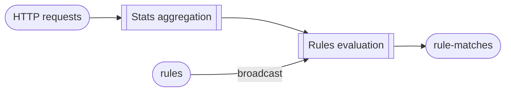

# Demo repository for handling state evolutions in Flink

> [!NOTE]
> This repository is a companion to the talk performed in a Flink Meetup on September 29th, 2026, in Paris, France.
> 
> Slides for this talk are available in this repository: [meetup-slides.pdf](meetup-slides.pdf)

## Overview

This repository contains a very simplified behavioral analysis pipeline to detect bots,
built with **Apache Flink 2.3.0** and **Java 21**.
Its real purpose is to have some long-lived keyed state worth evolving between two versions of a job.

For detail on the existing state and change examples, see: [EVOLUTIONS.md](EVOLUTIONS.md).



- **IP statistics** (`IpStatsFunction`) accumulates per-IP counters over a session, and emits the
  updated statistics on every request. There is no window: statistics accumulate for as long as
  requests keep arriving for that IP, and are discarded after 24 hours of inactivity.
- **Rule evaluation** (`RuleEvaluationFunction`) receives those statistics on its keyed input and
  the rules on a broadcast input, and emits a match when a rule's threshold is reached. A rule
  fires at most once per IP per session.

Input and output for the job are Kafka topics.

## Architecture

### Data format

All three Kafka topics carry JSON.

`http-requests` contains the HTTP requests to analyze:

```json
{"timestampMs":1789404388370,"ip":"10.0.0.11","path":"/cart","userAgent":"curl/8.5.0","statusCode":500}
```

`rules` contains a changelog of rules (publishing the same `ruleId` again replaces it, publishing it with
`"enabled":false` removes it):

```json
{"ruleId":"failing-a-lot","metric":"ERROR_RATIO_AT_LEAST","threshold":0.5,"minTotalRequests":50,"enabled":true}
```


`rule-matches` is the output topic and contains matches (the ID address, stats value and matching rule):

```json
{"ruleId":"failing-a-lot","ip":"10.0.0.66","metric":"ERROR_RATIO_AT_LEAST","observedValue":0.79,"threshold":0.5,"detectedAtMs":1789404498084}
```

### Rules
A rule defines the metric to evaluate, and the threshold to apply.

| `metric`                  | Fires when                           | Threshold       |
|---------------------------|--------------------------------------|-----------------|
| `TOTAL_REQUESTS_AT_LEAST` | request count ≥ threshold            | a count         |
| `ERROR_RATIO_AT_LEAST`    | share of failed requests ≥ threshold | between 0 and 1 |
| `DISTINCT_PATHS_AT_MOST`  | distinct path count ≤ threshold      | a count         |

In addition, rules carry a minimum number of requests in the stats before it can be evaluated at all:
for example, a single failed request is a 100% error ratio and shouldn't trigger all error-checking rules.


## Running the project

### Requirements

Java 21, Maven, Docker with Compose.

### Run

```bash
./scripts/start.sh              # Kafka + a Flink session cluster (hashmap backend)
mvn package                     # build the project if needed
./scripts/submit.sh             # submit the job
./scripts/generate-traffic.sh   # fake traffic, in its own terminal (contains one obvious bot)
./scripts/watch-matches.sh      # tail the matches, in another terminal

# This rule triggers on the bot's IP address: the bot fails about 80% of its requests
./scripts/publish-rule.sh failing-a-lot ERROR_RATIO_AT_LEAST 0.5 50

# This rule triggers on the bot's IP address: the bot only ever hits the /login path
./scripts/publish-rule.sh one-path-only DISTINCT_PATHS_AT_MOST 2 50
```

Access the Flink dashboard on <http://localhost:8081>.

When generating traffic and the aforementioned rules, within a few seconds,
`10.0.0.66` — which behaves like a credential stuffing bot — crosses the threshold and a match appears.

To remove a rule:

```bash
./scripts/publish-rule.sh failing-a-lot ERROR_RATIO_AT_LEAST 0.5 50 false
```

To stop the Flink server:
```bash
./scripts/stop.sh
```

Note that stopping the job keeps the savepoint and Kafka data, as both are bind-mounted.

To clear all data, including savepoints and Kafka data:
```bash
./scripts/stop.sh --clean
```

### Savepoint and restore

```bash
./scripts/savepoint.sh          # savepoint the running job, keep it running
./scripts/savepoint.sh --stop   # savepoint and stop, which is what you want before deploying v2
./scripts/submit.sh /flink-state/savepoints/savepoint-xxxx-yyyy # deploy the job from a savepooint
```

Savepoints are written in canonical format
(see *Savepoint formats* in [the Flink documentation on savepoints](https://nightlies.apache.org/flink/flink-docs-stable/docs/ops/state/savepoints/#triggering-savepoints)).
They land in `docker/state/savepoints/`, which is bind-mounted and survives `scripts/stop.sh`.

### Chosing the state backend

The default backend is Heap.

If you want to use RocksDB instead:

```bash
./scripts/start.sh rocksdb
```

Head and RocksDB backends do not fail the same way when the state schema no longer matches.

## Implementation notes

- **`IpStats` state is written by a hand-rolled serializer.** `state/IpStatsSerializer` replaces
  `PojoSerializer` for that one piece of state. It is not needed — it is there to show how a custom
  serializer is written, and it records a layout version so that a future layout change can be
  detected. Records between operators are unaffected and still use `PojoSerializer`.
- The Kafka connector is `5.0.0-2.2`: no build against Flink 2.3 has been released yet. It only
  uses `@Public` API and declares its Flink dependencies as `provided`, so it introduces no
  conflicting jars.
- The job jar bundles `slf4j`, which a Flink job jar normally should not. It is there so that
  `DemoDataGenerator` can run as a plain `java` process; Flink loads `org.slf4j` parent-first, so
  the bundled copies are ignored on the cluster.
